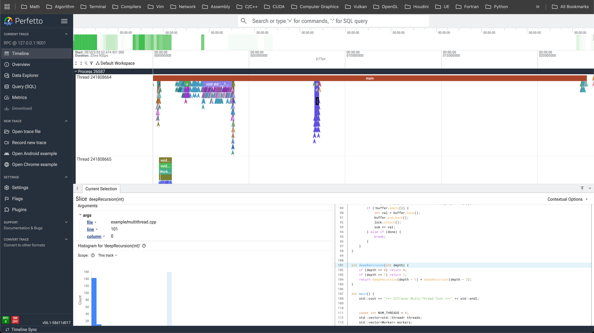

# CCVizTracer
A debugging and profiling tool that can trace and visualize C/C++ code execution.

<figure>
  
  <figcaption align="center"><b>Figure 1:</b> execution flow generated from example/multithread.cpp (compiled with gcc)</figcaption>
  
  <figcaption align="center"><b>Figure 2:</b> execution flow generated from example/multithread.cpp (compiled with clang) with source code preview</figcaption>
</figure>

## Usage
### Generate Trace
#### LLVM clang
If you are using `clang` then add `-fpass-plugin=cctracer_pass.dylib` and link against `cctracer`
```sh
# c
clang your_source_file.c -fpass-plugin=cctracer_pass.dylib -lcctracer
# c++
clang++ your_source_file.c -fpass-plugin=cctracer_pass.dylib -lcctracer
```

#### GNU gcc
For `gcc` users, add `-fplugin=cctracer_pass.dylib` and link against `cctracer`
```sh
# c
gcc your_source_file.c -fplugin=cctracer_pass.dylib -lcctracer
# c++
g++ your_source_file.c -fplugin=cctracer_pass.dylib -lcctracer
```

#### CMake
Check out `CMakeLists.txt` for CMake usage example.

### Execute
After execution, a `result.json` file will be produced. Put that file in [ui.perfetto.dev](https://ui.perfetto.dev/), then you will see the visualized result supported by perfetto.

### View Trace
```sh
# IMPORTANT: cd to your project dir so that vizcctracer can find your source file
# method 1: go to http://localhost:<port> and open the trace file within the ui
python3 <path-to>/vizcctracer.py
python3 <path-to>/vizcctracer.py -p <port> 
🌐 VizCCTracer running at http://localhost:<port>

# method 2: 
python3 <path-to>/vizcctracer.py -tf <path-to-your-trace>
🌐 VizCCTracer running at http://localhost:10000
```


## Use Case
<figure>
  
  <figcaption align="center"><b>Figure 2:</b> My own use case for exploring CPython source code execution</figcaption>
</figure>


---
*Inspired by GaoTian's viztracer(python)(https://github.com/gaogaotiantian/viztracer), Chrome's DevTools and Perfetto.*
